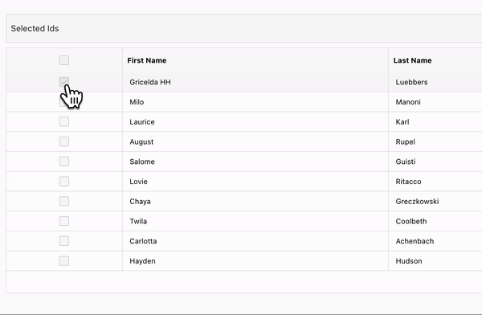
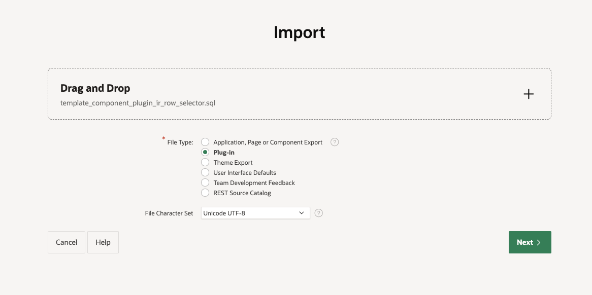
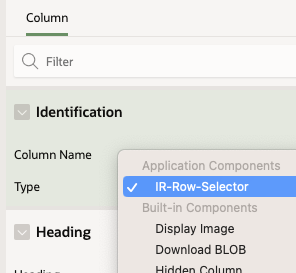
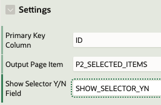
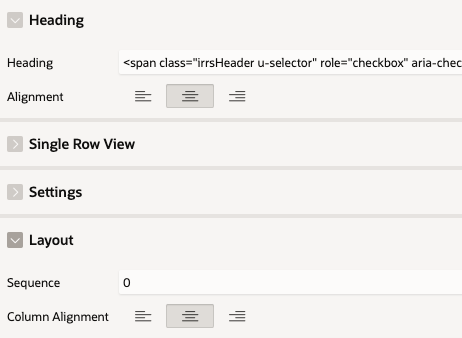
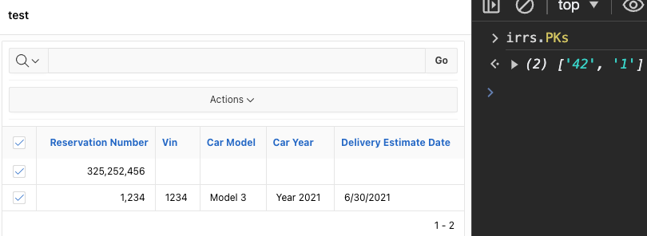

# IR Row Selector plugin

[Demo App](https://tqmbetacznh1j19-ila.adb.us-ashburn-1.oraclecloudapps.com/ords/f?p=149) (requires a Google account) 
You can also [download the demo app](misc/f149.sql).

## Description

A Plugin for Interactive Reports to imitate a portion the APEX$ROW_SELECTOR functionality (of the Interactive Grid). With this column type to your Interactive Report, selecting rows will automatically add the "primary key" of your choice to a javascript array named `irrs.PKs`:
<p align="center">
  
</p>

## How to configure

- Step 1 : Install the plugin
<p align="center">
  
</p>
  
- Step 2 : Create an Interactive Report
- Step 3 : In the Page Designer, designate / create a column to become your "row selector" column
<p align="center">
  
</p>

- Step 4 : Under the column "settings", identify:
  - a "Primary Key Column" (required)
  - an "Output Page Item" (optional)
  - a "Show Selector Y/N field" (optional)
<p align="center">
  
</p>

- Step 5: Replace the heading
<p align="center">
  
</p>
  
  Add the following heading for "Select All" functionality:
  ```
  <span class="irrsHeader u-selector" role="checkbox" aria-checked="false" aria-label="Select All Rows" title="Select All" aria-disabled="false" onclick="javascript:irrs.SelectAll(this);"></span>
  ```
  (Be sure to align the heading and the column so that it looks good.)

## Now give it a spin

Once configured, selecting rows in your IR will automatically populate a javascript array named `irrs.PKs`:

<p align="center">
  
</p>

If you have an "Output Page Item" configured (see above), the comma-delimited list of selected "Primary Keys" will dynamically be printed (client-side) into this Page Item.

## Suggestion

Send the contents of your "Output Page Item" to the database and loop through the contents using apex_string.split:
```
for rec in (select column_value
            from table(apex_string.split(p_selected_pks, ','))
)
loop
  -- do something
end loop;
```
